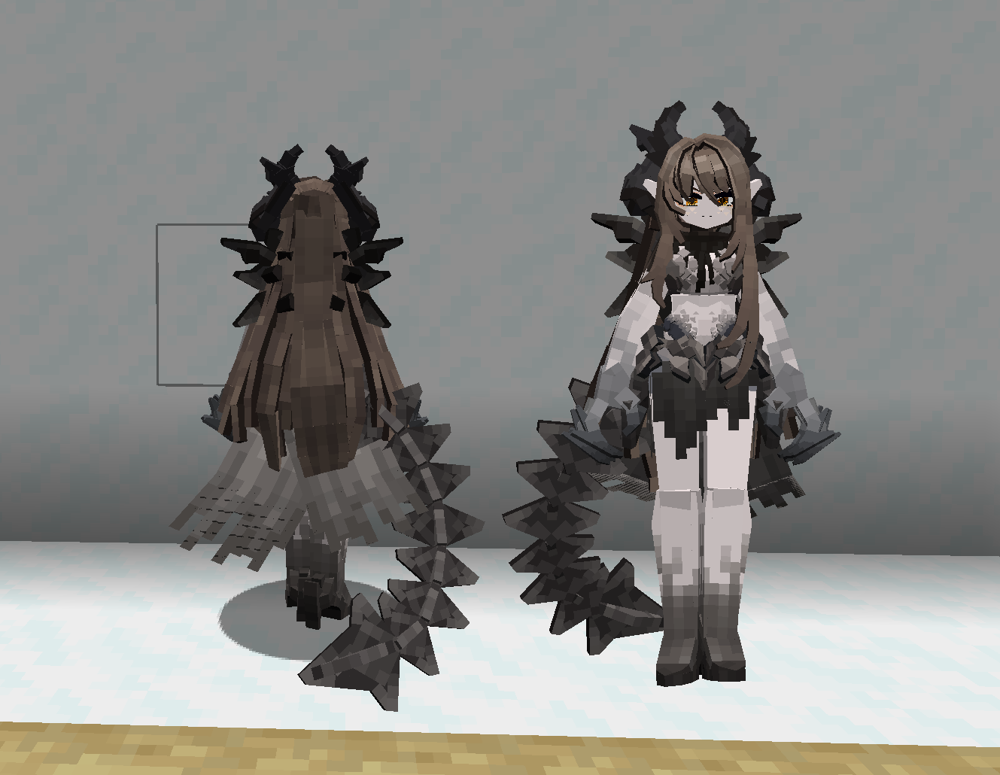
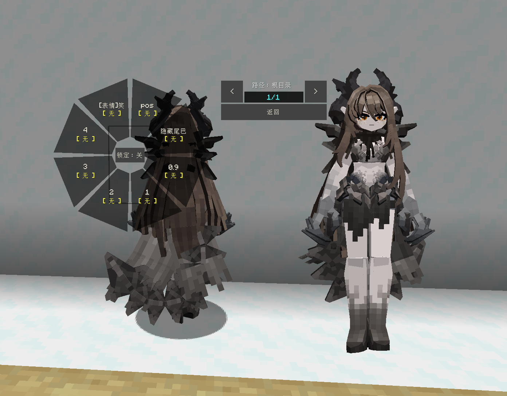

<<<<<<< HEAD
# Myth_耶梦加得_Jormungand

Model Details

- **Franchise / Category**: #Myth #神话

Author Details

- **Author**: [#0064 - #纸盒ALifang | #Cc-纸盒 | #Cc纸盒](../)
- **Author ID**: `0064`

Preview Images

<!-- GENERATED MODEL PREVIEW README START -->

<!-- GENERATED MODEL PREVIEW README END -->

=======
# Myth_耶梦加得_Jormungand

Model Details

- **Franchise / Category**: #Unknown

Author Details

- **Author**: [#0064 - #纸盒ALifang | #Cc-纸盒 | #Cc纸盒](../)
- **Author ID**: `0064`

Preview Images

Model Details

- **Franchise / Category**: #Myth

Author Details

- **Author**: [#0064 - #纸盒ALifang | #Cc-纸盒 | #Cc纸盒](../)
- **Author ID**: `0064`

## 预览图

Preview Images

<!-- GENERATED MODEL PREVIEW README START -->

<!-- GENERATED MODEL PREVIEW README END -->

>>>>>>> 005e414481d902bbc24cf0981342dd0e61cfb719
